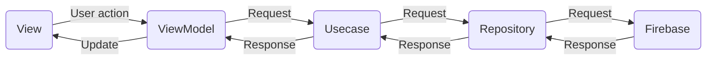

# TDL APP Architecture

This document provides a high-level description of the architecture employed in the TDL APP.  

### Criteria for adopting or changing architecture
- The architecture must be somewhat easy to understand for newcomers to app development and have low learning costs.
- The architecture should not vary greatly in writing style from person to person.
- It should be simple, with low implementation cost, and be able to withstand long-term maintenance and improvement.
- The architecture should be easy to write tests for and not impose a heavy burden on the user.
- The libraries required for implementation should be de facto standards, and long-term maintenance should be expected.

## Bird's-eye view

- The classes are managed by separating layers for each responsibility :)  
- The connection of each layer is as shown in the overhead view above, and in principle, no connection should be made by jumping between layers such as UI <-> Usecase.

### View
- View is responsible for displaying UI parts such as text, images, and buttons.  
- The logic used is limited to the display of parts according to the ViewModel's state, and the ViewModel is basically responsible for processing by user operations, etc.  

### ViewMode
- ViewMode is responsible for managing the State that controls the display of the View, and for requesting the necessary data and updates to the Use case based on user operations received from the View.  
- Basically, it is a 1:1 relationship with each screen.

### Usecase
- Usecase is responsible for acquiring necessary data from each Repository (described below) based on user operations received from ViewModel, processing the data, and returning it to ViewModel.  
- As a result, it is often a 1:1 relationship with ViewModel.  
- In many cases, a single UseCase has multiple Repositories, which often have a 1:n relationship.

### Repository
It is responsible for converting raw data retrieved from Firebase into a format that is easy for the application to use and passing it to Usecase.
